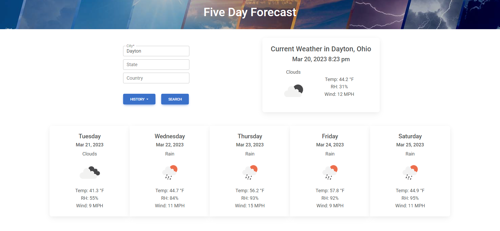

# CBC Week 06 Challenge: Weather Forecast Dashboard
## Description

This project is the sixth challenge from the coding bootcamp from UC Berkeley.  The challenge was to create a weather forecast dashboard.  The dashboard will show the current weather and a 5 day forecast for the city that the user searches for.  The following features were required:

- Use the OpenWeather API to retrieve weather data for cities.  The API documentation is at https://openweathermap.org/api.
- The current weather and the 5 day forecast will be displayed for the city that the user searches for.  It will show the following for each day:
  - City Name
  - Date
  - Icon image (visual representation of weather conditions)
  - Temperature
  - Relative Humidity
  - Wind Speed
- After being searched for, the city will be added to the search history.
  - The user can click on any of the cities in the search history to see the current weather and 5 day forecast for that city without looking it up.

There were many difficult elements to this project.  The biggest problem was the data being retreived from the API's were incomplete or organized ineficiently for the purposes of the forecast.

The first problem I encountered was to use the OpenWeather API's a latitute and longitude for the city were needed, so the Geocoding API was used to get the lat and long for the city. The Geocoding API returns a JSON object that contains an array of results. However, the first result was not necessarily the correct choice.  I didn't want to require the user to parse through the results to find the right city.  Therefore, I limited it to one result, but gave the user the option to be more specific with their search criteria by allowing the state and country codes to be used.  This helped to narrow down the results and usually provided the right city as the one returned result, except in extreme circumstances.

The second problem was that the Weather API returns the weather data in 3 hour intervals.  This was not useful for the 5 day forecast, as I only had one block to display all the data for the day.  I grouped together the data for each day, and then averaged the Temperature, Humidity, and Wind Speed.  For the weather description and icon, I used the most commonly seen description and icon for the day.  This was not perfect, but it was the best I could do with the data that was available.

The last problem was that the forecast API does not provide the current weather data.  I had to use the OpenWeather Current Weather API to get the current weather data.  This was not a problem, but it was a little confusing to have to use two different API's to get the data for the current weather and the 5 day forecast.  Furthermore, the timestamps for the data was converted to local time when using the dayjs library until I added a UTC plugin.  Many hours of my life were lost trying to determine why the timestamps were not correct.  I finally found the solution on Stack Overflow.

## Mock Up

The mock up below was provided in the bootcamp homework materials.  We were to create our our HTML, CSS, and JS so the final product does not look the same as the mockup, but it has much of the same functionality and flow.  

## Final Product

The final product is deployed at https://jdempe.github.io/bootcamp-06-weather-forecast/.
### Usage

The user interface for the weather forecast dashboard is shown below.  The user can:
1. Search for a city by its city name, state code (US only), and Country code.  Only the city code is required.
   1. Clicking enter at any time will search for the city.
   2. Invalid city names will be rejected and the user will be notified.
2. The user can click on the History dropdown to see the last 10 cities that they searched for.  The user can click on any of the cities in the dropdown to see the current weather and 5 day forecast for that city.

### User Interface

The major interface features are the search block, the current weather block, and the 5 day forecast block.

When the History drop down is clicked, it will show the last 10 cities that the user searched for.

## Credits

### Resources

The below resources contributed to the project.

- [Open Weather API](https://openweathermap.org/api) was used to retrieve the weather data.  Three different API's from OpenWeather were used.
  - [Geocoding API](https://openweathermap.org/api/geocoding-api#description)
  - [Current Weather API](https://openweathermap.org/current)
  - [5 Day Forecast API](https://openweathermap.org/forecast5#bulk)

- [MDBootstrap](https://mdbootstrap.com/) was the CSS Framework used on this project. There was a lot of work in the Javascript for this homework so I wanted to use a CSS framework that would make the CSS easier to write.  MDBootstrap was the best choice for this project.

- [Day.js](https://day.js.org/) is the library used to handle the date and time.  It is a lightweight alternative to Moment.js.

- [jQuery](https://jquery.com/) is a fast, small, and feature-rich JavaScript library.

- [W3 Schools](https://www.w3schools.com/js/default.asp) provides great tutorials on many Javascript methods.

- [Icons8](https://icons8.com/icons/set/question-mark) provided the question mark icon used on the page before loading the weather data.
  
- [The Home Page Network ](https://www.thehomepagenetwork.com/weather/banner-weather/) provided the header art.

- [StackOverflow](https://stackoverflow.com/) provided many answers to my questions:
  - https://stackoverflow.com/questions/4075057/javascript-unfocus-a-textbox
  - https://stackoverflow.com/questions/14542062/eventlistener-enter-key
  - https://stackoverflow.com/questions/58820229/how-to-show-loading-icon-till-await-finishes
  - https://stackoverflow.com/questions/61368563/day-js-is-not-converting-utc-to-local-time

- [Unix Timestamp](https://www.unixtimestamp.com/) was used to convert the timestamps to a readable format for troubleshooting.
  
### Collaborators

On this project, there was no peer review.

## License

Refer to the LICENSE in the repository.

## How to Contribute

Contribute at https://github.com/JDempe/bootcamp-06-weather-forecast.